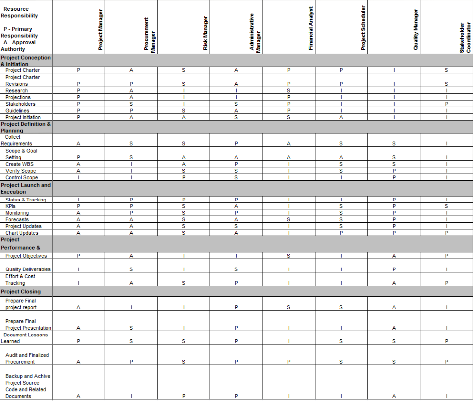
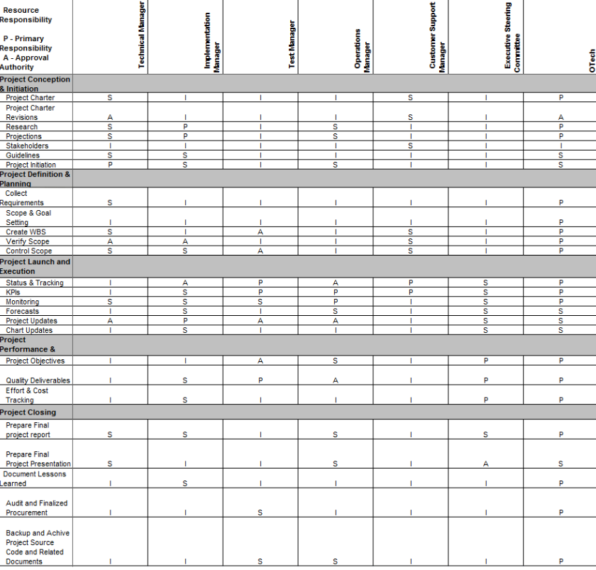

# PROJECT OVERVIEW
## B. PLANNING THE PROJECT

### Project Management Life Cycle

The project management life cycle is represented and documented in the form of Gantt Chart which allows Group A memners to follow the guidelines and achieved the milestone from time to time. The project life cycle WBS breakdown the task and work of every members such as project manager into several modules. Every member have their own roles and part in every stage of the lifecycle based on the constructed WBS.

Project management WBS with Gantt Chart shown below:

### Scope
The work breakdown structure (WBS) above created to map all the necessary tasks and develop the process which the WBS will be maintained and approve.

In this emotion detection project, we are suggested to identify the scope of the project. For this project, it will capture people face to detect and track the state facial of customers in the supermarket,then, to view the customer of this project, of their feedback to enhance the business. Therefore, it is feasible to use emotional knowledge of a person which can be identified by this system.

### Risk Identification Chart (Quality, Cost, Time)

| Control Element | What is likely to go wrong? | How and when will I know? | What will I do about it? |
|-----|----|-------|-----|

### Responsibility Assignment Matrices (RAM)

