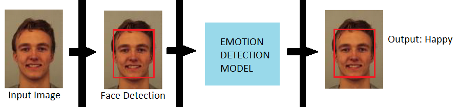
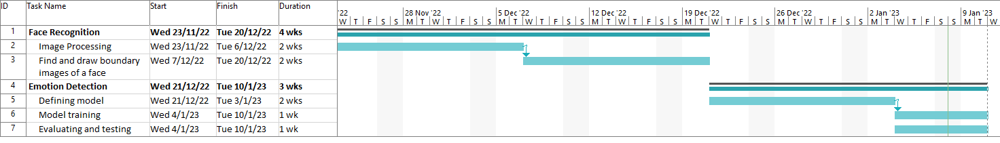
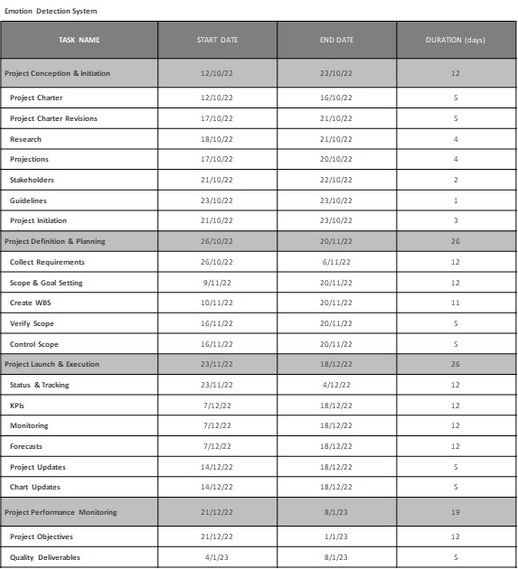
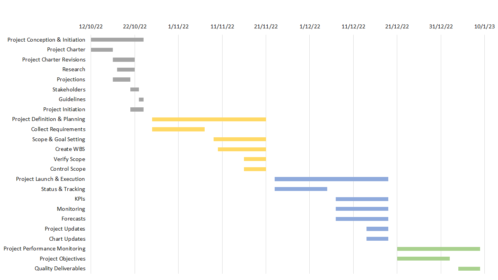

# C. IMPLEMENTING THE PROJECT PLAN
### Deliverables:
#### Hardware Requirement:
For the hardware, our group uses a laptop (intel core i7 and 16GB RAM) to conduct our project.

#### Software Requirement:
For the software, our group used python programming language to implement the code for intelligent module in emotion detection system.

#### Intelligent System Architecture
The project used a custom Emotion Detector model, which is a Convolutional Neural Network Model.

#### Outcomes of the system
Given an input image, the first step of the system would be to detect a face from the input, allowing a rectification of the facial area to a rectangle resembling a frontal view so that the system can run the model only on the face. These rectified detections are then fed into the Emotion Detector model for emotion detection.

#### Tasks and Estimated Costs

| Task |  Estimated Costs | Notes |
|-----|----|----|
|   Server Maintenance         |RM 1200                         |  Database      |      
|   Cultural resources         |RM 1500                         |  Investigate and evaluate undertaking                                                 |                              |
|   Equipment and equipment use|RM 250                           | Equipment preparation and setup                                                       |                              |
|   TOTAL                      |RM 2750                        |  Estimated     |                              |

#### Milestones

Microsoft Project :

PowerPoint :

 
 
 

##### Next: [Project Execution](D-PROJECT_EXECUTION.md)
