# **D. EXECUTING THE PROJECT**

## **Project Design and Coding**

### Flowchart:
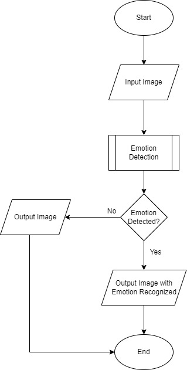

## **Description of the project coding**

### **Libraries and Packages Required:**

Below are the library that will be used in this project

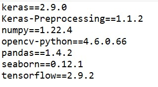

### **Training the Emotion Detection Model**
Firstly, we import the required libraries for Emotion Detector

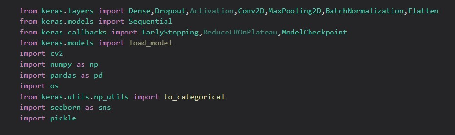

Then, we read all the training and testing images and store them in a pandas dataframe. Images contain images with the shape 48x48x1. Labels depict the emotion of that image. Purpose has 2 values T and V. T stand for training and V stand for validation  
The images used are taken from kaggle which can download from [here](https://www.kaggle.com/msambare/fer2013/download)

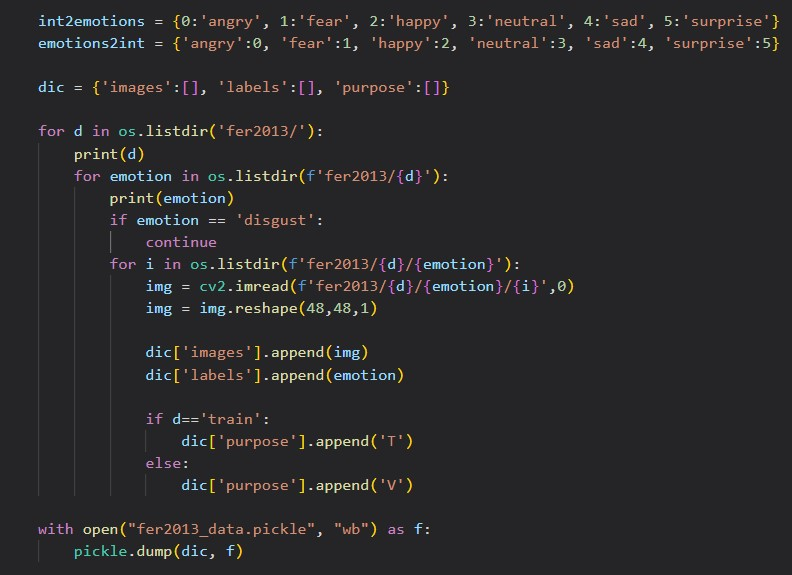

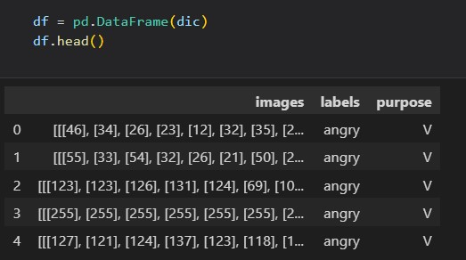

After that, we separate the training data and validation data.  
We creating 2 different data frames, first for the training and second for the validation

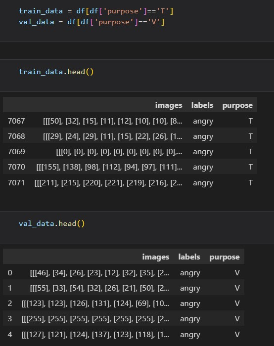

Next, we check the number of each type of emotion label for training data and validation data. From the figure below, we have six classes of emotion that we plan to train the neural network model to detect and recognize. The six classes of emotion include Happy, Neutral, Sad, Fear, Angry and Surprise.

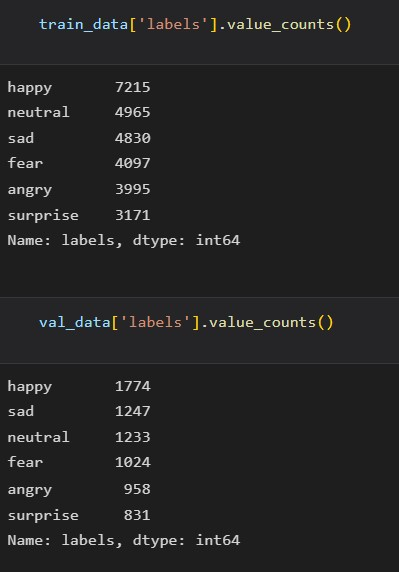

As we can see in the image below that the labels are very unbalanced in the training data so we will balance them in the next step.

In order to deal with the unbalanced data, we take the initiative to extract equal number of samples from all of the classes. Here we are taking 3171 instances of every emotion and combine them to make one final pandas dataframe.

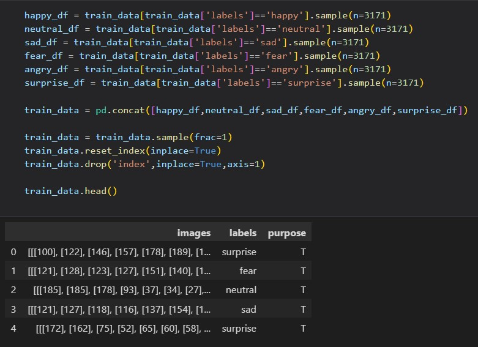

After we create the new training data, we check again the values in the labeld column of training data. From figure below, we can see that all the classes are balanced now.

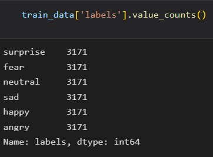

Next, we declare some of the constants that will be used when we train our neural network model at following step.

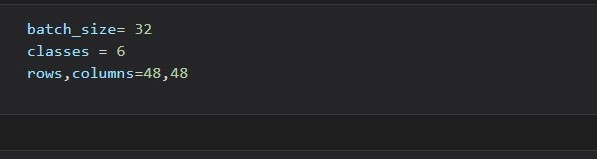

Final step before moving to create the neural network model is replacing the labels of the training and testing data to integer like "Angry" to 0, "Fear" to 1, and so on. Then, these numbers are converted to one-hot encoded using function to_categorical. We doing this because neural network model can better understand number.  
We aldo convert the image column to list and then to a numoy array for training purposes

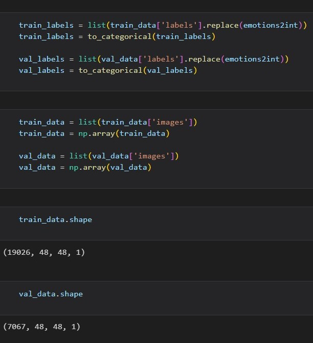

Now we can define our convolutional neural network model for this project.  We create four blocks of Conv2D - BatchNormalization - Conv2D - BatchNormalization - MaxPooling2D - Dropout layers, 3 blocks of Dense - Batch - Dropout layers and finally 1 Dense layer consisting of 6 nodes because we have six classes.

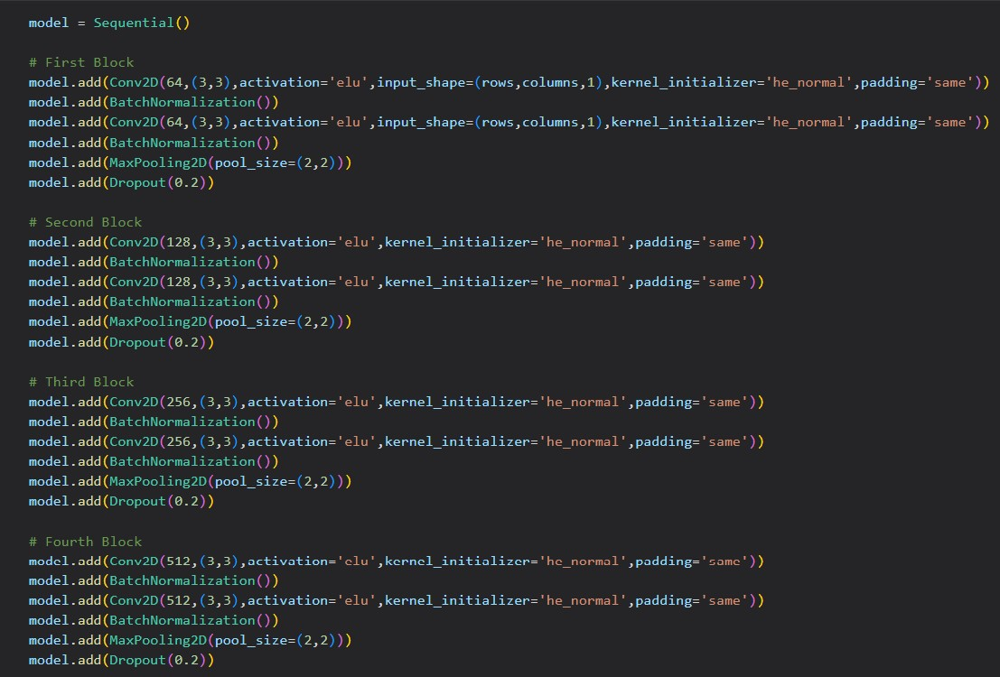
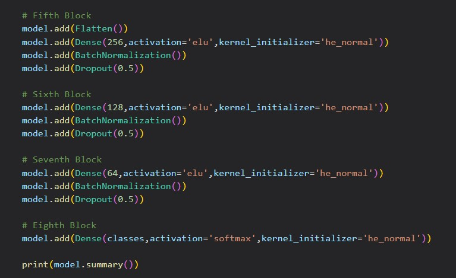

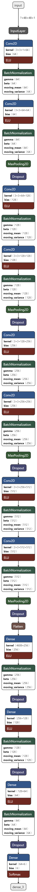

The next step is declaring the Checkpoint and EarlyStopping callback.

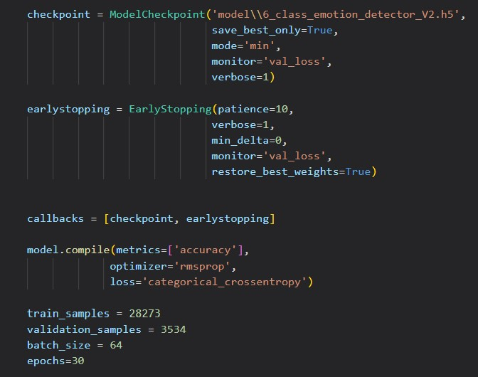

Finally, we train the model with 30 epochs and batch size of 64.

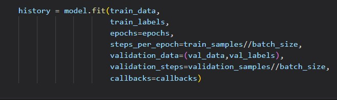
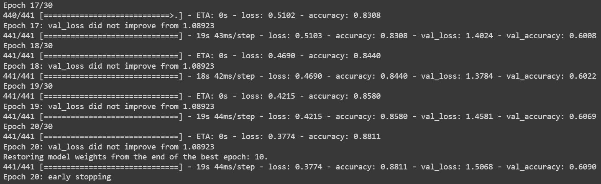

## **Project Result**

### Live prediction using OpenCV:

```python
from keras.models import load_model
import numpy as np
import cv2

model = load_model('model/6_class_emotion_detector_V2.h5')
cap = cv2.VideoCapture(0)

classifier = cv2.CascadeClassifier('Haarcascades\\haarcascade_frontalface_default.xml')

int2emotions = {0:'angry', 1:'fear', 2:'happy', 3:'neutral', 4:'sad', 5:'surprise'}
emotions2int = {'angry':0, 'fear':1, 'happy':2, 'neutral':3, 'sad':4, 'surprise':5}

def detect_face(frame):
    faces=classifier.detectMultiScale(frame,1.3,4)
    if faces==():
        return frame
    for x,y,w,h in faces:
        cv2.rectangle(frame,(x,y),(x+w,y+h),(172,42,251),2)
        face = frame[y:y+h,x:x+w]
        face = cv2.cvtColor(face,cv2.COLOR_BGR2GRAY)
        face = cv2.resize(face,(48,48))
        face = face.reshape(1,48,48,1)
        cv2.putText(frame,text=int2emotions[np.argmax(model.predict(face))],
                    org=(x,y-15),fontFace=cv2.FONT_HERSHEY_SIMPLEX,fontScale=1,color=(106,40,243),thickness=2)
    return frame

# Live Predictor
while True:
    ret,frame= cap.read()
    if ret==True:
        cv2.imshow('emotion_detection_system',detect_face(frame))
        if cv2.waitKey(1)== ord("q"):
            break
cap.release()
cv2.destroyAllWindows()
```

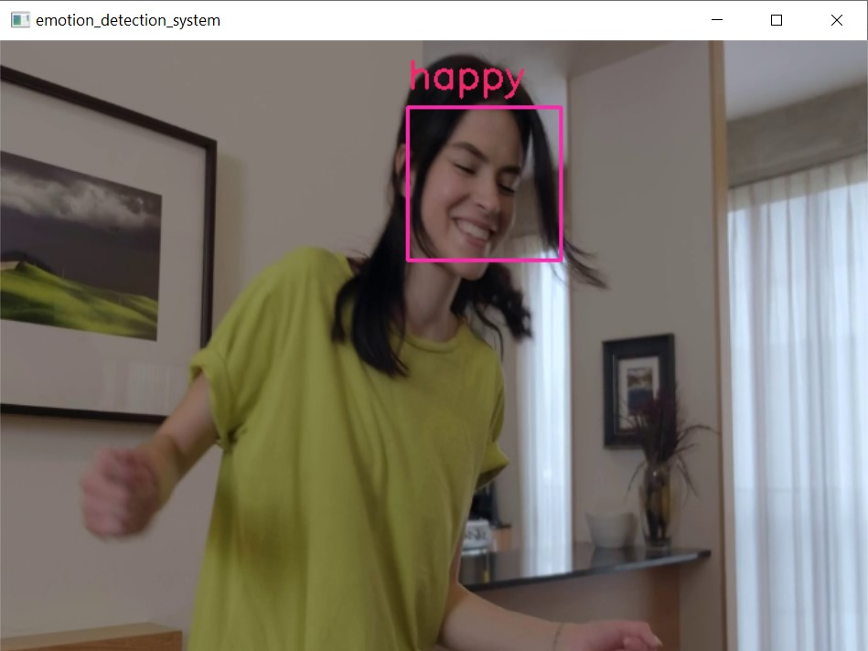

<br>
<br>
<br>

##### Next: [Project Closing](E-PROJECT_CLOSING.md)
