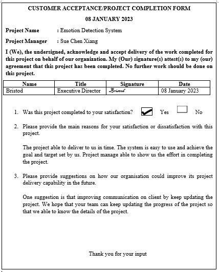
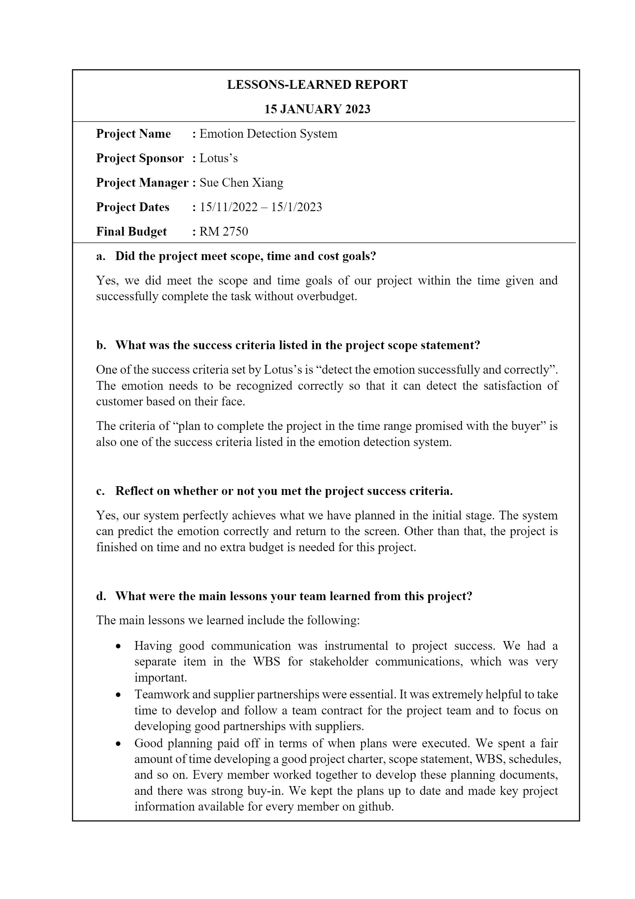

# **E. COMPLETING THE PROJECT**

## Closing Checklist

1. Customer Acceptance Form

2. Lessons Learned Document

3. Final Project Report

EMOTION DETECTION SYSTEM

1.0 PROJECT OCJECTIVE

1. To develop an artificial intelligence system that are able to detect and recognize human face emotion
2. To develop a system that are able to classify the type of emotion in a human face
3. To develop an application programming interface (API) that can integrate the webcam to the system so that emotion can be detected at real time using webcam

2.0 SUMMARY OF PROJECT RESULT

After the system has been completed, we tested the accuracy of the system. The system can achieve accuracy of 72%

3.0 ORIGINAL AND ACTUAL SCHEDULE

The project member sticks to the Gantt chart scheduled so, the actual progress fits the original schedule.

4.0 ORIGINAL AND ACTUAL BUDGET

The actual budget matches the original budget, which means that the team has followed the budget planned at the beginning of the project and does not use any excessive money.

 
 

4. Close Contract

